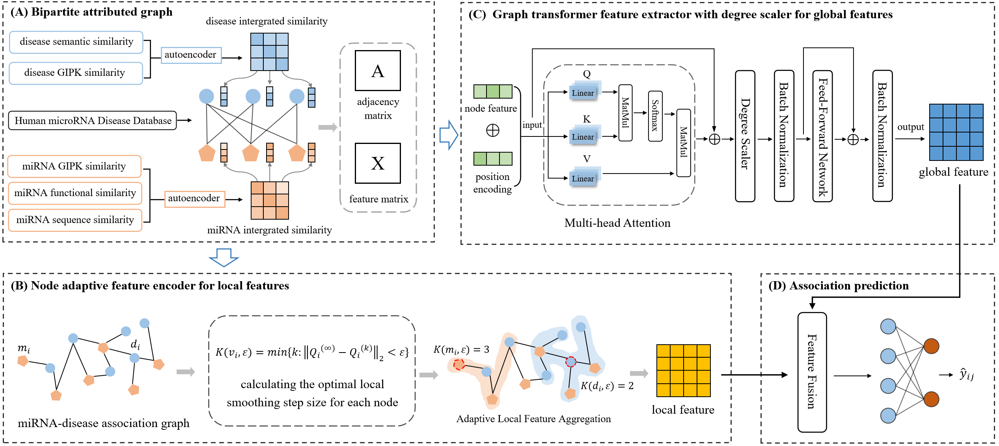

# LGFMDA
**LGFMDA: miRNA-disease association prediction with local and global feature representation learning**

  

Fig. 1. The flowchart of LGFMDA: (A)Constructing the miRNA-disease attributed bipartite graph based on multiple similarity features and known association information. (B) Calculating the optimal feature iteration step for each node to effectively aggregate local features of the nodes. (C) Utilizing graph Transformer encoder to learn global feature information of nodes. (D) Integrating local and global features and use a classifier for association prediction.

# Dependencies
* python == 3.6
* torch == 1.9.0+cu111 
* numpy == 1.19.5
* dgl-cu111 == 0.6.1

# Dataset
 ``D_GIP3.2：`` Gaussian interaction profile kernel similarity of diseases\
 ``disease semantic similarity_3.2：``semantic similarity of diseases\
 ``M_GIP3.2：`` Gaussian interaction profile kernel similarity of miRNAs\
 ``SeqSim3.2：`` miRNA sequence similarity\
 ``miRNA fuctional similarity_3.2：`` miRNA fuctional similarity\

# Resources
* utils_new: Data reading and construction of attribute bipartite graph
* model_gt_fang_hmdd32_lpe: The overall implementation code of the LGFMDA
* train2_hmdd32_lpe: Training of the model
